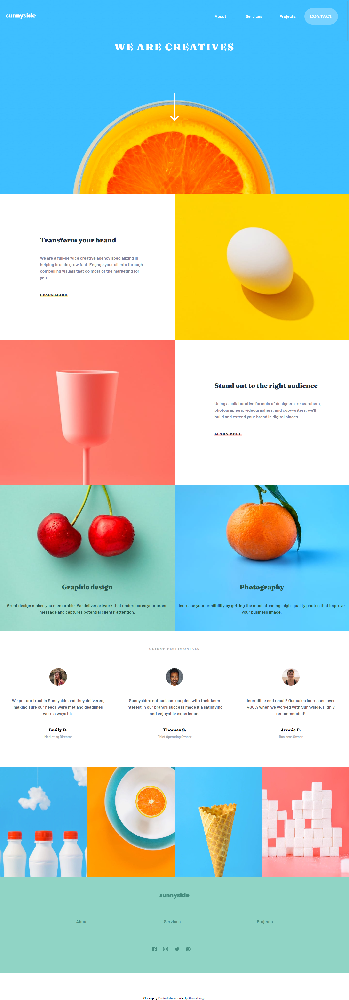
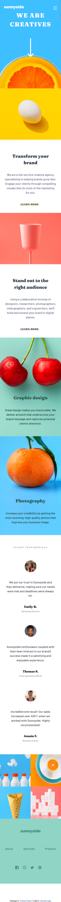

# Frontend Mentor - Sunnyside agency landing page solution

This is a solution to the [Sunnyside agency landing page challenge on Frontend Mentor](https://www.frontendmentor.io/challenges/sunnyside-agency-landing-page-7yVs3B6ef). Frontend Mentor challenges help you improve your coding skills by building realistic projects.

## Table of contents

- [Overview](#overview)
  - [The challenge](#the-challenge)
  - [Screenshot](#screenshot)
  - [Links](#links)
- [My process](#my-process)
  - [Built with](#built-with)
  - [What I learned](#what-i-learned)
  - [Continued development](#continued-development)
- [Author](#author)

## Overview

### The challenge

Users should be able to:

- View the optimal layout for the site depending on their device's screen size
- See hover states for all interactive elements on the page

### Screenshot

-Desktop

-Mobile

Add a screenshot of your solution. The easiest way to do this is to use Firefox to view your project, right-click the page and select "Take a Screenshot". You can choose either a full-height screenshot or a cropped one based on how long the page is. If it's very long, it might be best to crop it.

Alternatively, you can use a tool like [FireShot](https://getfireshot.com/) to take the screenshot. FireShot has a free option, so you don't need to purchase it.

Then crop/optimize/edit your image however you like, add it to your project, and update the file path in the image above.

**Note: Delete this note and the paragraphs above when you add your screenshot. If you prefer not to add a screenshot, feel free to remove this entire section.**

### Links

- Solution URL: [GitHub Repo](https://github.com/abhisheksinghwork7/Sunnyside-agency-landing-page)
- Live Site URL: [Vercel App](https://sunnyside-agency-landing-page-xi.vercel.app/)

## My process

### Built with

- Semantic HTML5 markup
- CSS custom properties
- Flexbox
- Mobile-first workflow

### What I learned

Through this project I got a better understading of flex. haw we can use flex to place the objects on our page for dektop and mobile version seperately without having to define each measurement.

Creating a customizable nav bar, with features of adropdown list. moving around the nave bar for the mobile and desktop versions.

Most importantly, I learned the basics of SVG image. How easily they are cusomizable in css if we are using the image inline HTML. This was a majot learning on this project.

### Continued development

I need to work more on making the website more responsive so that I dont have to hard code the width and height of the element for each device.

## Author

- Frontend Mentor - [@abhisheksingh7](https://www.frontendmentor.io/profile/abhisheksinghwork7)

